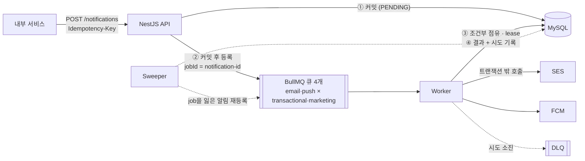
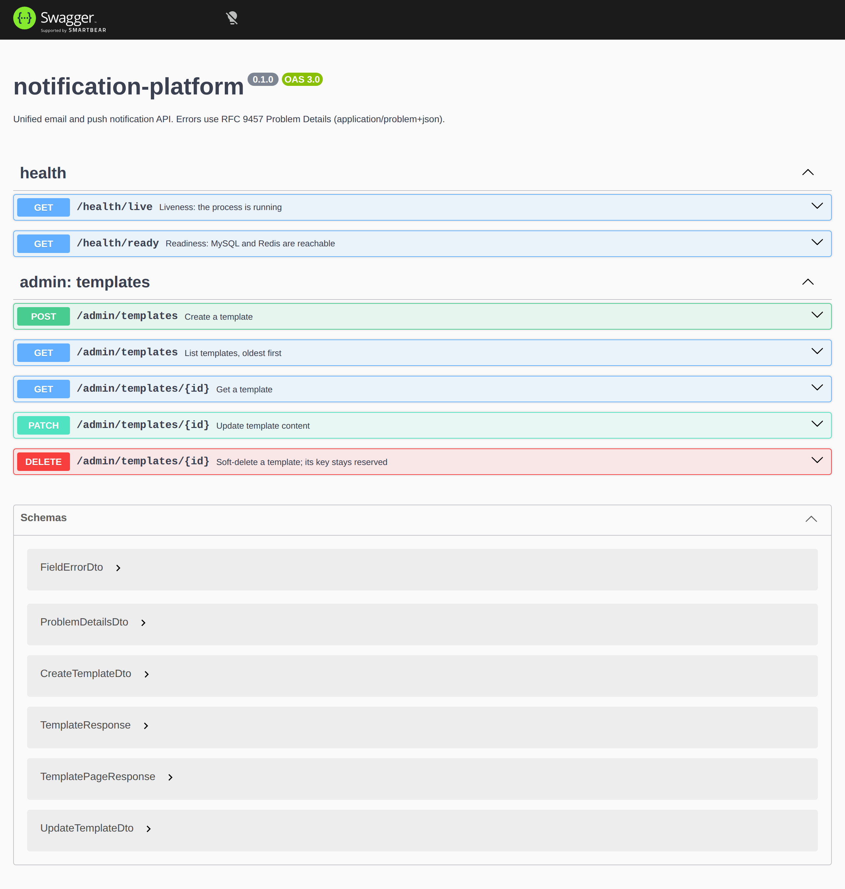
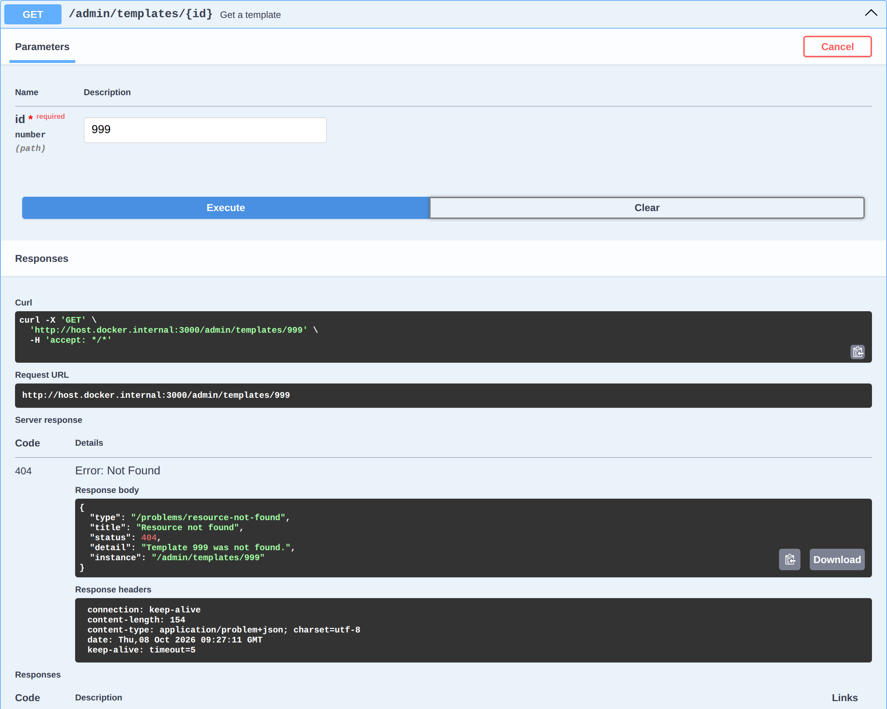
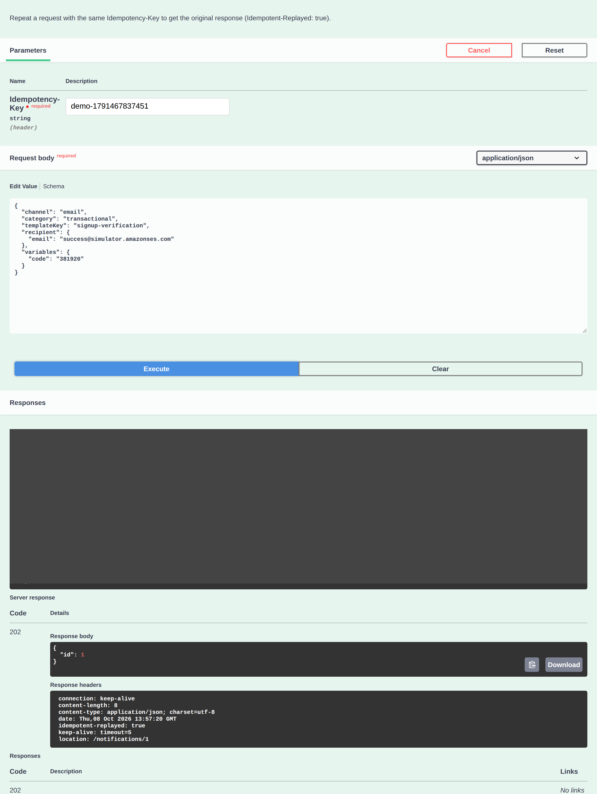
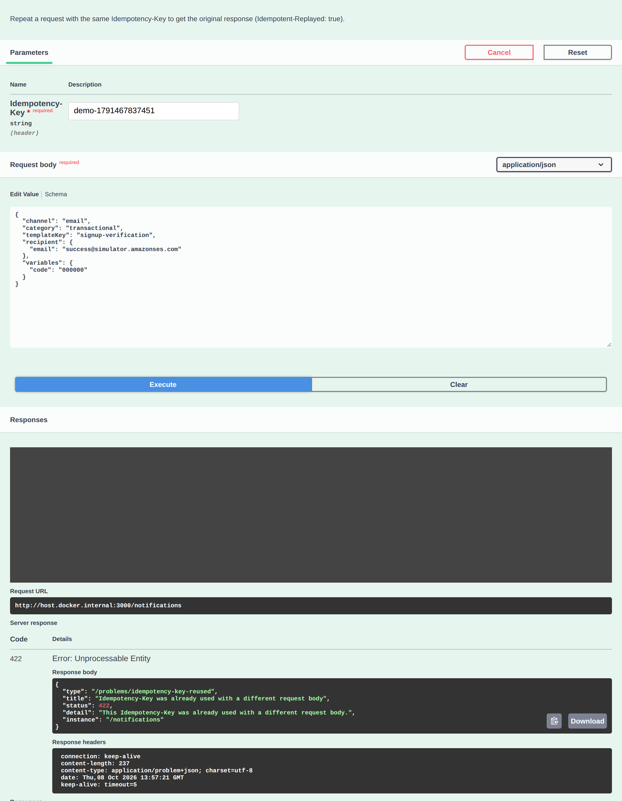
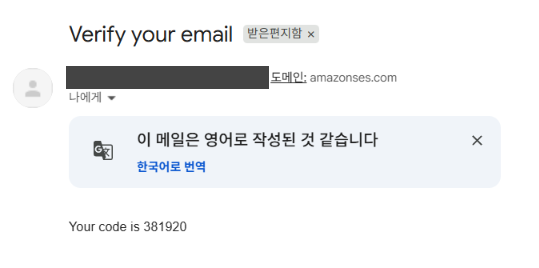
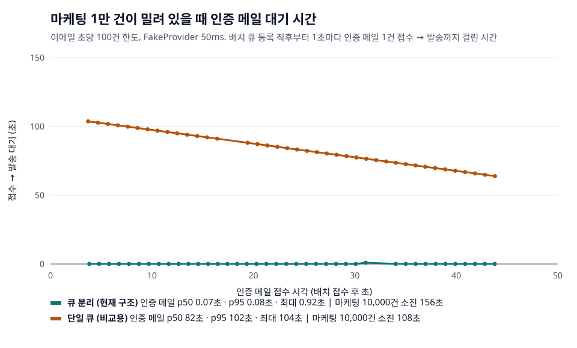
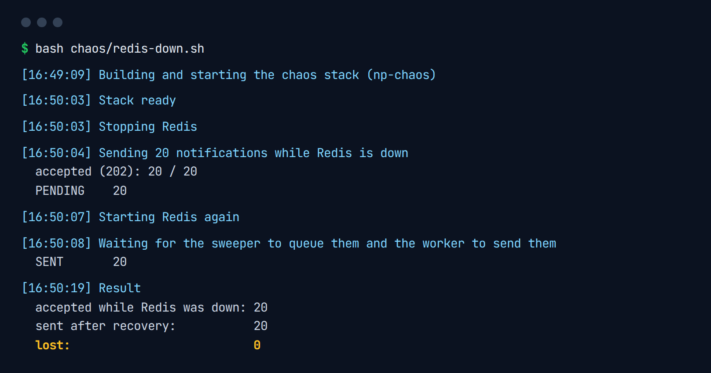
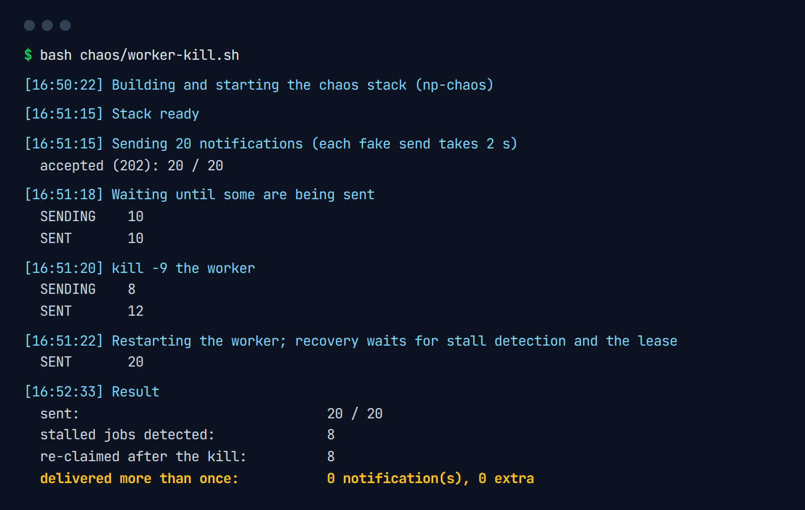
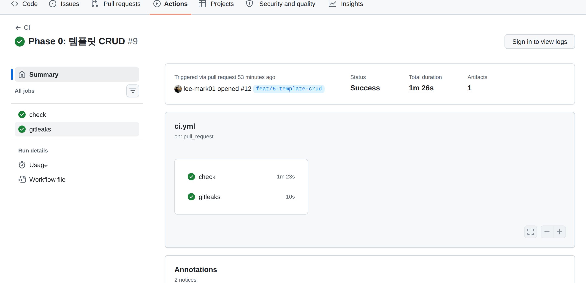

# notification-platform

[](https://github.com/lee-mark01/notification-platform/actions/workflows/ci.yml)

이메일(AWS SES)과 웹 푸시(FCM)를 하나의 API로 보내는 알림 플랫폼입니다. 핵심은 **유실과 중복**입니다. 요청이 여러 번 와도 알림은 하나만 만들고, Redis나 Worker가 죽어도 접수한 알림을 잃지 않으며, 막을 수 없는 중복 발송 구간은 정의하고 측정합니다.

> 기반(Phase 0), 설계(Phase 1), 정상 흐름(Phase 2), 실패 처리(Phase 3), SES 웹훅·알림함·읽음 추적(Phase 4)까지 구현했습니다. 대량 발송, 관리 화면, 관측은 다음 단계입니다.

## 한눈에 보기

- **접수는 202로 바로, 발송은 큐 뒤에서**: `POST /notifications`가 알림을 DB에 커밋한 뒤 채널 × 유형별 BullMQ 큐 4개 중 하나에 넣고, Worker가 SES·FCM으로 보냅니다.
- **요청 멱등성**: `Idempotency-Key`를 먼저 잡는 2단계 처리. 같은 키로 동시에 10건이 와도 알림은 1건이고, 잠금이 넘어간 경우는 펜싱 토큰으로 막습니다.
- **발송 멱등성**: 모든 상태 전이는 조건부 UPDATE 한 문장입니다. Worker는 lease를 잡고 보내며, 같은 job이 두 번 실행돼도 한 번만 보냅니다.
- **실패 처리**: 일시 오류는 지수 백오프 + jitter로 재시도, 다 쓰면 DEAD + DLQ, 운영자가 redrive. 영구 오류는 즉시 FAILED, 잘못된 주소는 수신거부에 등록합니다.
- **유실 방지**: 큐 등록에 실패하면 알림은 PENDING으로 남고 Sweeper가 다시 넣습니다. Outbox 테이블 없이 알림 행의 상태가 그 역할을 합니다.
- **정책**: 발송 직전에 수신거부 목록과 마케팅 동의를 확인합니다.



## 장애 시나리오

설계 단계에서 장애 시나리오 13개를 정하고, 각각을 테스트나 장애 재현 스크립트로 확인합니다. 상태 전이와의 대응은 [상태 머신](docs/design/state-machine.md#장애-시나리오-매핑)에 있습니다.

| #   | 시나리오                         | 결과                                                               | 확인                                                                               |
| --- | -------------------------------- | ------------------------------------------------------------------ | ---------------------------------------------------------------------------------- |
| 1   | 같은 Idempotency-Key로 동시 요청 | 동시 10건 → 알림 1건 (나머지는 409 또는 저장된 응답)               | E2E [`intake`](test/notifications/intake.e2e-spec.ts)                              |
| 2   | DB 커밋 직후 Redis 다운          | Redis 정지 중 20건 접수 → 복구 후 20건 SENT, 유실 0                | [chaos](chaos/README.md) + E2E [`sweeper`](test/sweeper/sweeper.e2e-spec.ts)       |
| 3   | Provider 5xx 3번                 | 백오프 후 SENT, 시도 기록 4행                                      | E2E [`worker`](test/queue/worker.e2e-spec.ts)                                      |
| 4   | 잘못된 이메일 주소               | 재시도 없이 FAILED + 수신거부 등록                                 | E2E [`send-policy`](test/queue/send-policy.e2e-spec.ts)                            |
| 5   | 최대 재시도 초과                 | DEAD + DLQ → redrive → SENT                                        | E2E [`worker`](test/queue/worker.e2e-spec.ts), [`dlq`](test/admin/dlq.e2e-spec.ts) |
| 6   | 처리 중 Worker `kill -9`         | stall 감지 → lease 만료 후 재점유 → 전부 SENT, 중복 발송 측정(0건) | [chaos](chaos/README.md) + E2E [`worker`](test/queue/worker.e2e-spec.ts)           |
| 7   | Worker 정상 종료(SIGTERM)        | 진행 중 job 완료 후 종료, 남은 SENDING 0, stall 0                  | [chaos](chaos/README.md) + E2E [`shutdown`](test/queue/shutdown.e2e-spec.ts)       |
| 8   | 수신거부 사용자에게 발송         | SUPPRESSED, 시도 0회                                               | E2E [`send-policy`](test/queue/send-policy.e2e-spec.ts)                            |
| 9   | 등록되지 않은 FCM 토큰           | 재시도 없이 토큰 비활성화                                          | E2E [`push-tokens`](test/queue/push-tokens.e2e-spec.ts)                            |
| 10  | 같은 SNS 메시지 2번              | 1번만 저장·반영, 두 번째도 200                                     | E2E [`sns-webhook`](test/webhooks/sns-webhook.e2e-spec.ts)                         |
| 11  | 서명이 위조된 SNS 요청           | 다른 키·변조·다른 토픽·SNS 밖 인증서 → 403, 0건 저장               | E2E [`sns-webhook`](test/webhooks/sns-webhook.e2e-spec.ts)                         |
| 12  | 같은 읽음 요청 반복              | 첫 읽음 시각 유지                                                  | E2E [`inbox`](test/inbox/inbox.e2e-spec.ts)                                        |
| 13  | 마케팅 대량 발송 중 인증 메일    | 인증 메일 대기 p50: 단일 큐 82초 → 큐 분리 0.07초                  | [실험](load/priority-isolation/README.md)                                          |

SES와 FCM에는 멱등 키가 없어 exactly-once는 불가능합니다. 전달 보장은 at-least-once이고, 중복이 생기는 구간(발송 완료 직후 결과 기록 전에 Worker가 죽는 경우)을 [ADR-0002](docs/adr/0002-delivery-guarantee-and-idempotency.md)에 정의했습니다.

## 핵심 결정

| 결정                                              | 이유                                                                | 문서                                                            |
| ------------------------------------------------- | ------------------------------------------------------------------- | --------------------------------------------------------------- |
| 큐를 채널 × 유형 4개로 분리                       | 마케팅 대량 발송이 인증 메일의 처리 슬롯을 차지하지 않게            | [ADR-0001](docs/adr/0001-queue-routing.md)                      |
| 멱등 키를 먼저 잡는 2단계 + 펜싱 토큰             | 동시 요청을 유니크 제약으로 거르고, 잠금이 넘어가도 완료는 소유자만 | [ADR-0002](docs/adr/0002-delivery-guarantee-and-idempotency.md) |
| 상태 전이는 모두 조건부 UPDATE                    | "읽고 판단"하지 않고 DB가 원자적으로 판단                           | [상태 머신](docs/design/state-machine.md)                       |
| Outbox 대신 커밋 후 등록 + Sweeper                | 알림 행의 PENDING이 곧 미발행 기록, 구성 요소를 늘리지 않음         | [ADR-0003](docs/adr/0003-sweeper-over-outbox.md)                |
| 오류를 일시·영구로 나눠 재시도                    | 잘못된 주소는 재시도하지 않고, 계정 문제는 DLQ에서 되살릴 수 있게   | [상태 머신](docs/design/state-machine.md#재시도와-dlq-t4-t5)    |
| 에러 응답은 RFC 9457, 수정 충돌은 ETag + If-Match | 표준을 따름                                                         | [API 명세](docs/design/api.md)                                  |

## 기술 스택

- Node.js, TypeScript, NestJS
- MySQL 8, TypeORM
- BullMQ, Redis
- AWS SES v2, Firebase Cloud Messaging (SNS 웹훅은 Phase 4)
- Jest, Testcontainers
- Docker Compose, GitHub Actions

## 설계 문서

코드를 쓰기 전에 데이터 모델, 상태 전이, API 계약, 핵심 결정을 먼저 정했습니다. 장애 시나리오 13개가 각각 어떤 상태 전이와 데이터로 처리되는지는 상태 머신 문서에 정리했습니다.

| 문서                                      | 내용                                                                                       |
| ----------------------------------------- | ------------------------------------------------------------------------------------------ |
| [ERD](docs/design/erd.md)                 | 테이블·인덱스(각 인덱스가 어떤 조회를 위한 것인지), 대량 insert·통계·이력 보관에 대한 판단 |
| [상태 머신](docs/design/state-machine.md) | 알림 상태와 조건부 UPDATE 전이, 멱등 키 처리, 장애 시나리오 13개 매핑, 반례 검토로 고친 것 |
| [API 명세](docs/design/api.md)            | 인증, `Idempotency-Key` 규칙, 엔드포인트별 요청·응답·상태 코드·problem type                |
| [ADR](docs/adr/README.md)                 | 큐 분리, 전달 보장과 멱등성, Outbox 대신 Sweeper, TypeORM                                  |

## 실행

요구 사항: Node.js 24.15 이상 (`.nvmrc`), Docker

```bash
cp .env.example .env
docker compose up -d
npm ci && npm run migration:run && npm run start:dev
```

`docker compose up -d`는 MySQL과 Redis만 띄웁니다. 앱까지 컨테이너로 실행하려면 `docker compose --profile app up -d --build`를 사용합니다. 이때 `migrate` 서비스가 먼저 마이그레이션을 실행하고 종료하며, 성공해야 `app`이 시작됩니다.

MySQL은 로컬에 설치된 MySQL과 충돌하지 않도록 호스트 포트 3307을 기본값으로 사용합니다.

## API 문서

`SWAGGER_ENABLED=true`이면 Swagger UI(`/docs`)와 OpenAPI JSON(`/docs-json`)을 제공합니다. 기본값은 `false`이며, `.env.example`에서는 개발용으로 켜 둡니다.



## 에러 응답

헬스체크를 제외한 모든 에러는 [RFC 9457 Problem Details](https://www.rfc-editor.org/rfc/rfc9457) 형식(`application/problem+json`)으로 응답합니다. 클라이언트는 `title`이나 `detail`이 아니라 `type`으로 오류를 구분합니다.

```json
{
  "type": "/problems/validation-failed",
  "title": "Request validation failed",
  "status": 400,
  "detail": "One or more fields are invalid.",
  "instance": "/notifications",
  "errors": [
    { "field": "recipient.email", "message": "email must be an email" }
  ]
}
```

| type                                    | status           | 의미                                                                      |
| --------------------------------------- | ---------------- | ------------------------------------------------------------------------- |
| `/problems/validation-failed`           | 400              | 요청 검증 실패. `errors`에 필드별 오류                                    |
| `/problems/resource-not-found`          | 404              | 요청한 리소스가 없음                                                      |
| `/problems/idempotency-key-missing`     | 400              | `Idempotency-Key` 헤더 누락                                               |
| `/problems/idempotency-key-in-progress` | 409              | 같은 키의 요청이 아직 처리 중                                             |
| `/problems/idempotency-key-reused`      | 422              | 같은 키가 다른 요청 본문으로 재사용됨                                     |
| `/problems/template-key-conflict`       | 409              | 이미 사용 중인 템플릿 key (삭제된 템플릿 포함)                            |
| `/problems/template-unusable`           | 422              | 템플릿이 없거나 삭제됨, 채널 불일치, 필수 변수 누락                       |
| `/problems/recipient-unusable`          | 422              | 수신자를 확인할 수 없음 (없는 사용자)                                     |
| `/problems/precondition-failed`         | 412              | `If-Match`가 현재 `ETag`와 다름 (그사이 수정됨)                           |
| `/problems/precondition-required`       | 428              | `If-Match` 헤더가 필요한 요청에 없음                                      |
| `/problems/internal-error`              | 500              | 서버 내부 오류. 상세 내용은 응답하지 않고 로그에만 남김                   |
| `about:blank`                           | 상태 코드 그대로 | HTTP 상태 외에 추가 의미가 없는 오류 (예: 없는 경로 404, 잘못된 JSON 400) |

`instance`에는 쿼리 문자열을 제외한 요청 경로가 들어갑니다. 한 번 공개한 `type` URI의 의미는 바꾸지 않습니다.

아래는 실행 중인 API에 없는 템플릿(`GET /admin/templates/999`)을 요청한 실제 응답입니다. 본문은 RFC 9457 형식이고 `Content-Type`은 `application/problem+json`입니다.



## 발송 API

내부 서비스는 `X-API-Key`로 인증하고 `POST /notifications`로 발송을 요청합니다. 모든 요청에 `Idempotency-Key`가 필요합니다.

```bash
npm run client:create -- my-service   # API 키 발급 (한 번만 표시)
```

| 상황                     | 응답                                                         |
| ------------------------ | ------------------------------------------------------------ |
| 접수                     | 202 `{ "id": ... }` + `Location` (발송은 큐 뒤에서 비동기로) |
| 같은 키·같은 본문 재요청 | 저장된 응답 그대로 + `Idempotent-Replayed: true`             |
| 같은 키·다른 본문        | 422 `idempotency-key-reused`                                 |
| 같은 키가 처리 중        | 409 `idempotency-key-in-progress` + `Retry-After`            |

- 접수 시점에 템플릿을 렌더링해 저장합니다. 이후 템플릿이 바뀌어도 이미 접수한 알림의 내용은 그대로입니다.
- 접수한 알림은 채널 × 유형별 큐 4개(`email-transactional` 등)에 `jobId = notification-{id}`로 등록됩니다. Redis가 내려가 있어도 접수는 202로 성공하고 알림은 `PENDING`으로 남습니다(E2E로 확인).
- 같은 키로 동시에 10건을 보내도 알림은 1건만 생깁니다(E2E로 확인).
- 상태는 `GET /notifications/{id}`로 조회합니다. 다른 클라이언트의 알림은 404입니다.
- 자세한 계약은 [API 명세](docs/design/api.md), 처리 방식은 [ADR-0002](docs/adr/0002-delivery-guarantee-and-idempotency.md).

아래는 실행 중인 API에 같은 `Idempotency-Key`로 요청을 다시 보낸 실제 응답입니다. 요청 화면의 API 키는 가렸습니다.





## 발송 처리 (Worker)

큐마다 BullMQ Worker가 job을 꺼내 발송합니다. 상태 전이는 모두 조건부 UPDATE 한 문장입니다([상태 머신](docs/design/state-machine.md)).

1. 점유: `PENDING·QUEUED·RETRYING → SENDING` (또는 lease가 만료된 `SENDING` 재점유), `lease_until = DB 시각 + 60초`
2. Provider 호출: DB 트랜잭션 밖에서
3. 결과 기록: 상태(`SENT`·`RETRYING`·`FAILED`)와 `delivery_attempt` 1행을 한 트랜잭션으로

- 같은 알림의 job이 두 번 실행돼도 발송은 한 번입니다. 이미 `SENT`면 건너뛰고, 다른 Worker가 lease를 잡고 있으면 Provider를 부르지 않고 lease가 끝날 때까지 job을 미룹니다(E2E로 확인).
- Provider는 공통 인터페이스 뒤에 있습니다(어댑터 패턴). 테스트는 결과·지연·실패율을 주입할 수 있는 `FakeProvider`를 씁니다. 채널별 Provider는 `EMAIL_PROVIDER`, `PUSH_PROVIDER`로 고릅니다.
- 실제 이메일은 `EMAIL_PROVIDER=ses`로 AWS SES v2(서울 리전, 샌드박스)를 통해 보냅니다. SES SDK의 자체 재시도는 끄고(`maxAttempts: 1`) 재시도는 큐가 맡습니다. 그래야 시도마다 `delivery_attempt`에 남고 백오프가 한곳에서 관리됩니다. 메일박스 시뮬레이터 주소로 보내 `SENT`와 SES `MessageId` 저장을 확인했습니다.
- SES 오류 분류: 스로틀링·한도·SES 내부 오류·네트워크 오류는 일시 오류, `MessageRejected`·`BadRequestException`(잘못된 주소, 샌드박스의 미인증 수신자)은 영구 오류입니다. 계정 정지·발송 일시 중지처럼 메시지 탓이 아닌 오류는 일시 오류로 분류해 DLQ에서 다시 보낼 수 있게 했습니다.
  

- `SIGTERM`을 받으면 진행 중인 job을 끝내고 결과를 기록한 뒤 종료합니다(`enableShutdownHooks`, Worker를 DB보다 먼저 닫음). 장애 시나리오 7의 앱 내부 부분을 E2E로 확인했고, 실제 프로세스 종료는 chaos 스크립트로 확인합니다.
- Worker가 죽으면 BullMQ가 stall을 감지해 job을 되돌립니다. 다른 Worker가 아직 lease를 쥐고 있으면 그 job은 실패하지 않고 lease가 끝날 때까지 미뤄집니다(재시도 횟수를 쓰지 않음).
- `WORKERS_ENABLED=false`면 API만 띄웁니다.
- 실패는 일시·영구로 분류합니다. 일시 오류는 지수 백오프 + jitter(기본 2초부터, 최대 5번 시도)로 재시도하고, 마지막 시도까지 실패하면 `DEAD`로 바꿔 DLQ(`notification-dlq`)로 옮깁니다. 영구 오류는 재시도 없이 `FAILED`입니다.
  - 장애 시나리오 3: 5xx 3번 후 성공 → `SENT`, 시도 기록 4행 (E2E)
  - 장애 시나리오 5: 5번 모두 실패 → `DEAD` + DLQ job (E2E)
- 운영자는 `GET /admin/stats/read-rates`로 템플릿·채널별 읽음률(푸시는 클릭·알림함, 이메일은 Open 이벤트 기준 근사치)을 봅니다.
- 운영자는 `X-Admin-Key`로 `GET /admin/dlq`(DEAD 목록)와 `POST /admin/dlq/redrive`(다시 보내기)를 씁니다. DEAD가 아닌 건은 건너뛰므로 같은 redrive를 두 번 눌러도 한 번만 다시 보냅니다(E2E: DEAD → redrive → SENT).
- 커밋 후 큐 등록에 실패해 `PENDING`으로 남은 알림은 Sweeper가 다시 등록합니다. Outbox 테이블 대신 알림 행의 상태를 안전망으로 씁니다([ADR-0003](docs/adr/0003-sweeper-over-outbox.md)).
  - BullMQ job scheduler로 30초마다, 인스턴스가 여러 개여도 한 번만 돕니다.
  - 오래 머문 `QUEUED`·`RETRYING`·`SENDING` 중 job이 사라진 것도 다시 넣습니다.
  - 장애 시나리오 2: Redis가 꺼진 상태에서 접수 → `PENDING` → 복구 후 sweep → `SENT` (E2E)
- 발송 직전에 수신거부 목록과 마케팅 동의를 확인합니다. 접수와 발송 사이에 사용자가 동의를 철회해도 막힙니다. 막힌 알림은 `SUPPRESSED`가 되고 Provider를 부르지 않습니다.
  - 장애 시나리오 8: 수신거부 주소 → `SUPPRESSED`, 시도 기록 0행 (E2E)
  - 장애 시나리오 4: Provider가 주소 자체를 거부 → 재시도 없이 `FAILED` + 수신거부 등록, 다음 알림은 Provider 전에 차단 (E2E)
  - 마케팅은 사전 동의한 사용자에게만 보냅니다(`PUT /me/marketing-consent`). 사용자 정보가 없는 주소로 가는 마케팅은 동의를 확인할 수 없어 보내지 않습니다.

## 대량 발송

`POST /notification-batches`로 수신자 최대 10,000명을 한 번에 접수합니다. `Idempotency-Key` 규칙은 단건과 같습니다.

- 전부 아니면 전무: 수신자를 모두 검증·렌더링한 뒤, 하나라도 쓸 수 없으면 아무것도 접수하지 않고 `recipients[3].userId`처럼 위치로 알려 줍니다.
- 배치 행과 알림 N행을 한 트랜잭션에서 500행씩 다중 INSERT로 저장하고 202를 돌려줍니다. 큐 등록은 응답 뒤에 500건씩 `addBulk`로 합니다. 진행은 `GET /notification-batches/{id}`의 `status`와 상태별 건수(`byStatus`)로 봅니다.
- 다중 INSERT 뒤 id를 "첫 id + i"로 계산하지 않습니다. MySQL 8 기본 설정은 동시 insert가 있으면 연속 id를 보장하지 않기 때문에 `batch_id`로 다시 조회합니다.
- 등록이 중간에 멈추면(프로세스 종료, Redis 다운) Sweeper가 진행이 멈춘 배치를 찾아 이어서 등록합니다([ADR-0003](docs/adr/0003-sweeper-over-outbox.md#대량-발송에-적용-pr-73)).
- 1만 명 접수는 로컬에서 약 2.4초입니다. 처음 4.9초였는데, 구간별로 재 보니 수신자마다 템플릿을 다시 컴파일하는 데 2.6초를 쓰고 있어 컴파일 결과를 캐시했습니다.
- 발송 속도는 Provider 한도 안에서 큐별로 제한합니다. SES 한도는 계정 단위라 이메일 한도(`EMAIL_RATE_PER_SEC`)를 거래성 30%, 마케팅 70%로 나눠 BullMQ `limiter`로 겁니다([ADR-0005](docs/adr/0005-job-retention-and-rate-limits.md)).

### 큐 분리 효과 (장애 시나리오 13)

마케팅 1만 건이 밀려 있는 동안 인증 메일 40건을 1초 간격으로 보내, 큐를 나눈 현재 구조와 모든 알림을 한 큐에 넣는 비교 구성(`QUEUE_ROUTING=single`)을 같은 한도(초당 100건)에서 비교했습니다. 방법과 원자료는 [실험 문서](load/priority-isolation/README.md)에 있습니다.

| 구성    | 인증 메일 대기 p50 | p95    | 마케팅 1만 건 소진 |
| ------- | ------------------ | ------ | ------------------ |
| 큐 분리 | 0.07초             | 0.08초 | 156초              |
| 단일 큐 | 82초               | 102초  | 108초              |

큐를 나누면 인증 메일은 마케팅 적체와 상관없이 바로 나갑니다. 대신 거래성 몫(30%)을 비워 두므로 마케팅은 더 오래 걸립니다. 인증 메일이 늦으면 가입이 막히고 마케팅이 1분 늦는 것은 문제가 되지 않아 이 비용을 받아들였습니다.



## SES 웹훅

SES의 배달·반송·신고·오픈 이벤트는 Configuration Set → SNS 토픽 → `POST /webhooks/ses`로 들어옵니다.

- 저장하거나 외부 호출을 하기 전에 SNS가 보낸 메시지인지 확인합니다. 토픽 ARN이 일치해야 하고, 서명 인증서가 `sns.<region>.amazonaws.com`에서 온 것이어야 하며, 서명(SHA1/SHA256)이 맞아야 합니다. 하나라도 어긋나면 403이고 아무것도 저장하지 않습니다(장애 시나리오 11).
- SNS는 2xx를 받을 때까지 다시 보냅니다. `MessageId` 유니크 제약으로 같은 메시지는 한 번만 저장하고, 중복에도 200으로 답합니다(장애 시나리오 10).
- 구독 확인 메시지는 검증한 뒤 SNS 주소일 때만 `SubscribeURL`을 호출합니다.
- 이벤트 반영(조건부 UPDATE라 늦게 온 이벤트는 되돌리지 못함):
  - Delivery → `SENT`에서 `DELIVERED`
  - 영구 Bounce → `BOUNCED` + 수신거부(HARD_BOUNCE). 일시 Bounce(메일함 가득 참 등)는 상태를 바꾸지 않음
  - Complaint → `COMPLAINED` + 수신거부(COMPLAINT)
  - Open → 첫 번째 오픈 시각을 `read_at`에(이미지 차단·선로딩 때문에 근사치)
- SES는 우리가 `SENT`를 기록하기 전에 이벤트를 보낼 수 있습니다. 그런 이벤트는 미처리로 남기고 Sweeper 주기마다 다시 매칭합니다(24시간까지). 수신거부는 매칭과 상관없이 받는 즉시 등록합니다.

### 실제 SES 이벤트 받기 (설정)

SNS가 로컬 앱에 닿도록 공개 HTTPS 주소가 필요합니다. 여기서는 ngrok을 씁니다(D11). 리전은 SES와 같은 서울(`ap-northeast-2`)입니다.

1. **ngrok**: 설치 후 계정의 authtoken을 등록하고, 앱 포트를 엽니다. 출력된 `https://….ngrok-free.app` 주소를 씁니다.
   ```bash
   ngrok http 3000
   ```
2. **SNS 토픽**: SNS 콘솔 → 주제 생성 → 표준, 이름 예: `ses-events`. 주제 ARN을 `.env`의 `SNS_TOPIC_ARN`에 넣습니다.
3. **SES가 토픽에 게시할 권한**: 주제 → 편집 → 액세스 정책에 아래 문장을 추가합니다(계정 ID와 ARN은 본인 것으로).
   ```json
   {
     "Sid": "AllowSesPublish",
     "Effect": "Allow",
     "Principal": { "Service": "ses.amazonaws.com" },
     "Action": "sns:Publish",
     "Resource": "arn:aws:sns:ap-northeast-2:<계정ID>:ses-events",
     "Condition": { "StringEquals": { "AWS:SourceAccount": "<계정ID>" } }
   }
   ```
4. **Configuration Set**: SES 콘솔 → 구성 세트 생성, 이름 예: `notification-events` → 이벤트 대상 추가 → 이벤트 유형 Deliveries, Hard bounces, Complaints, Opens → 대상 Amazon SNS, 2번 주제. 이름을 `.env`의 `SES_CONFIGURATION_SET`에 넣습니다.
   - 발송 IAM 정책의 `Resource`를 ID로 좁혀 두었다면 `arn:aws:ses:ap-northeast-2:<계정ID>:configuration-set/notification-events`도 허용해야 합니다.
5. **앱 실행 후 구독**: `.env`를 반영해 앱을 띄우고(`EMAIL_PROVIDER=ses`), SNS 콘솔 → 구독 생성 → 프로토콜 HTTPS, 엔드포인트 `https://<ngrok 주소>/webhooks/ses`. 앱이 서명을 검증한 뒤 자동으로 구독을 확인합니다(로그 `Subscribed to …`, 콘솔 상태 "확인됨").
6. **확인**: SES 메일박스 시뮬레이터로 보내면 이벤트가 돌아옵니다.
   - `success@simulator.amazonses.com` → `DELIVERED`
   - `bounce@simulator.amazonses.com` → `BOUNCED` + 수신거부(`HARD_BOUNCE`)
   - `complaint@simulator.amazonses.com` → `COMPLAINED` + 수신거부(`COMPLAINT`)

## 사용자 API

웹 푸시를 받을 브라우저는 `POST /devices`로 FCM 토큰을 등록합니다. 사용자는 `Authorization: Bearer <JWT>`(HS256, `sub` = 사용자 id)로 인증합니다. 실제 서비스에서는 별도 인증 서비스가 토큰을 발급한다고 가정하고, 로컬에서는 CLI로 발급합니다.

```bash
npm run user:token -- me@example.com   # 사용자를 찾거나 만들고 1시간짜리 토큰 출력
```

- 알림함: `GET /me/notifications`(최신순, `(created_at, id)` 커서, `unread=true`), `GET /me/notifications/unread-count`, `PATCH /me/notifications/{id}/read`·`/unread`, `POST /me/notifications/read-all`. 실제로 발송된 알림만 보입니다.
- 읽음은 `read_at IS NULL`일 때만 기록하는 조건부 UPDATE라, 같은 요청을 반복해도 처음 읽은 시각이 그대로입니다(장애 시나리오 12, E2E).
- 같은 토큰을 다시 등록하면 200으로 갱신(upsert)하고, 비활성화된 토큰은 다시 활성화합니다.
- 서명 알고리즘은 HS256으로 고정하고 `exp`가 없는 토큰은 거부합니다(`alg: none`, 만료, 다른 키 서명 등 E2E로 확인).

## 웹 푸시 (FCM)

`PUSH_PROVIDER=fcm`이면 Firebase Admin SDK로 사용자의 활성 토큰 전체에 한 번에 보냅니다(`sendEachForMulticast`).

- 토큰 하나라도 받았으면 성공으로 기록합니다. 부분 성공을 재시도하면 이미 받은 브라우저에 또 가기 때문입니다.
- FCM이 "등록되지 않은 토큰"이라고 답하면 그 토큰을 비활성화합니다. `invalid-argument`는 잘못된 토큰일 수도, 잘못된 메시지일 수도 있어서, 같은 메시지를 다른 토큰이 받았을 때만 토큰 문제로 보고 비활성화합니다(Firebase 토큰 관리 가이드).
- 활성 토큰이 없으면 재시도 없이 실패합니다.
- 장애 시나리오 9: 사용자의 토큰이 모두 등록 해제 → 재시도 없이 `FAILED`(시도 1번, FCM 호출 1번), 토큰 전부 비활성화. 다음 알림은 FCM을 부르지 않고 실패합니다. 실제 `FcmProvider`에 가짜 FCM 응답을 넣은 Worker E2E로 확인했습니다.

### 데모 페이지로 직접 받아 보기

`web-push-demo/`는 Firebase JS SDK와 서비스 워커로 이 브라우저의 FCM 토큰을 받아 `POST /devices`로 등록하는 페이지입니다. `.env`에 Firebase 웹 앱 설정과 VAPID 공개 키를 넣은 뒤:

```bash
npm run demo:config                     # .env → web-push-demo/config.js (커밋하지 않음)
npm run demo:serve                      # http://localhost:8080
npm run user:token -- me@example.com    # 페이지에 붙여넣을 JWT
```

API는 `PUSH_PROVIDER=fcm`, `CORS_ORIGINS=http://localhost:8080`으로 띄웁니다. 페이지에서 알림을 허용해 등록한 뒤 `POST /notifications`로 그 사용자(`recipient.userId`)에게 push를 보내면 브라우저 알림이 뜹니다. 알림을 누르면 데모 페이지가 열리고(이미 열려 있으면 앞으로) `PATCH /me/notifications/{id}/read`로 읽음이 기록됩니다. 서비스 워커의 클릭 처리는 Firebase SDK보다 먼저 등록해야 합니다(SDK의 클릭 처리기가 다른 처리기를 막기 때문).

## 템플릿 API

관리용 템플릿 CRUD는 `/admin/templates`에 있습니다. 관리자 인증은 Phase 6에서 추가합니다.

| 메서드·경로                                     | 성공                        | 주요 실패                        |
| ----------------------------------------------- | --------------------------- | -------------------------------- |
| `POST /admin/templates`                         | 201 + `Location`, `ETag`    | 400, 409 `template-key-conflict` |
| `GET /admin/templates?channel=&limit=&cursor=`  | 200 `{ items, nextCursor }` | 400                              |
| `GET /admin/templates/{id}`                     | 200 + `ETag`                | 404                              |
| `PATCH /admin/templates/{id}` (`If-Match` 필수) | 200 + 새 `ETag`             | 400, 404, 412, 428               |
| `DELETE /admin/templates/{id}`                  | 204                         | 404                              |

- 템플릿은 채널(email, push) 하나에 속합니다. email은 `subject`·`htmlBody`가 필수(`textBody` 선택), push는 `title`·`body`가 필수(`data` 선택)이고, 다른 채널의 필드는 거부합니다. `key`와 `channel`은 바꿀 수 없습니다.
- 본문에는 `{{변수}}` 자리표시자만 쓸 수 있습니다(Handlebars의 블록·헬퍼·경로·`{{{원문}}}` 출력은 거부). 본문에 쓰인 변수와 `requiredVariables`가 정확히 같아야 하고, 이메일 HTML 본문에서만 값이 HTML 이스케이프됩니다. 푸시 `data`는 렌더링하지 않고 그대로 보냅니다.
- 수정은 낙관적 락입니다. 조회 응답의 `ETag`를 `If-Match`로 보내야 하고, 그사이 다른 수정이 있었으면 412(`precondition-failed`), `If-Match`가 없으면 428(`precondition-required`)입니다. `If-Match`는 강한 비교를 하므로 약한 ETag(`W/"..."`)는 일치하지 않습니다.
- ETag는 이 낙관적 락 용도로만 씁니다. Express가 모든 GET 응답에 붙이는 자동 ETag는 꺼 두었으므로, `If-None-Match`로 `304 Not Modified`를 받는 캐시 재검증은 지원하지 않습니다.
- 삭제는 soft delete입니다. 삭제된 템플릿의 `key`는 다시 쓸 수 없습니다(과거 발송 이력이 같은 key로 다른 내용을 가리키지 않도록).
- 목록은 id 순서의 커서 페이지네이션입니다. `nextCursor`는 불투명한 값으로 그대로 다음 요청에 전달합니다.
- CORS를 켤 때는 브라우저 클라이언트가 읽을 수 있도록 `exposedHeaders`에 `ETag`와 `Location`을 포함해야 합니다.

## 헬스체크

| 경로                | 확인 대상                      | 응답                                     |
| ------------------- | ------------------------------ | ---------------------------------------- |
| `GET /health/live`  | 없음 (프로세스가 응답하는지만) | 항상 200                                 |
| `GET /health/ready` | MySQL, Redis (각 1초 제한)     | 모두 정상이면 200, 하나라도 실패하면 503 |

liveness는 의존성을 확인하지 않습니다. DB 장애로 liveness가 실패하면 오케스트레이터가 모든 인스턴스를 재시작하지만, 재시작으로는 DB 장애가 해결되지 않습니다. 의존성 장애는 readiness 실패로 처리해 트래픽만 받지 않게 합니다. `docker compose --profile app`의 `app` 컨테이너 healthcheck도 readiness를 사용합니다.

헬스체크의 503 응답은 RFC 9457 형식의 예외로, 어떤 의존성이 실패했는지 보여주는 Terminus 형식을 그대로 사용합니다.

```json
{
  "status": "error",
  "info": { "database": { "status": "up" } },
  "error": { "redis": { "status": "down", "message": "..." } },
  "details": {
    "database": { "status": "up" },
    "redis": { "status": "down", "message": "..." }
  }
}
```

## 데이터베이스 마이그레이션

스키마는 마이그레이션으로만 변경합니다. `synchronize`는 꺼져 있고, 앱은 기동할 때 마이그레이션을 실행하지 않습니다. 여러 인스턴스가 동시에 같은 마이그레이션을 실행하지 않도록 배포 단계에서 따로 실행합니다.

```bash
npm run migration:generate -- src/database/migrations/<Name>  # 엔티티 변경에서 생성
npm run migration:create -- src/database/migrations/<Name>    # 빈 마이그레이션
npm run migration:run
npm run migration:revert   # 마지막 1개 되돌리기
npm run migration:show
```

마이그레이션은 하나씩 별도 트랜잭션으로 실행됩니다. 단, MySQL은 DDL(`CREATE`, `ALTER`, `DROP`)을 실행하면 트랜잭션을 암묵적으로 커밋하므로, DDL이 중간에 실패하면 앞서 실행된 DDL은 롤백되지 않습니다. 그래서 마이그레이션은 작은 단위로 나눕니다.

## 장애 재현 (chaos)

프로세스와 인프라를 실제로 죽이는 시나리오(2, 6, 7)는 전용 Docker 스택에서 스크립트로 재현합니다. 실행 방법과 측정 기록은 [chaos/README.md](chaos/README.md)에 있고, 결과는 위 [장애 시나리오](#장애-시나리오) 표에 반영했습니다.

아래는 실제 실행 출력입니다. 실행에 1~2분이 걸려 GIF 대신 끝난 화면을 실었습니다.





## 테스트

```bash
npm test          # 단위 테스트
npm run test:e2e  # E2E 테스트 (Docker 필요)
npm run lint
npm run typecheck
```

E2E 테스트는 Testcontainers로 MySQL과 Redis 컨테이너를 띄워 실행합니다. 테스트 파일은 순차 실행(`--runInBand`)되고, 데이터를 쓰는 테스트는 `beforeEach`에서 `resetDatabase()`로 마이그레이션 기록을 제외한 모든 테이블을 비웁니다. 마이그레이션 테스트는 별도 데이터베이스를 사용합니다.

마이그레이션 테스트는 모든 마이그레이션을 실행한 뒤 엔티티와 DB 스키마의 차이가 없는지 확인합니다. 엔티티만 수정하고 마이그레이션을 만들지 않으면 CI가 실패합니다.

## 개발 방식

모든 변경은 이슈 → 브랜치 → PR → CI 통과 → 머지 순서로 진행합니다. `main`은 브랜치 보호로 직접 푸시를 막고, PR이 `check`(lint·타입 체크·포맷·단위/E2E 테스트·빌드)와 `gitleaks`(비밀값 유출 검사)를 모두 통과해야 머지할 수 있습니다. PR 설명에는 변경 이유와 테스트 근거를 적습니다.


