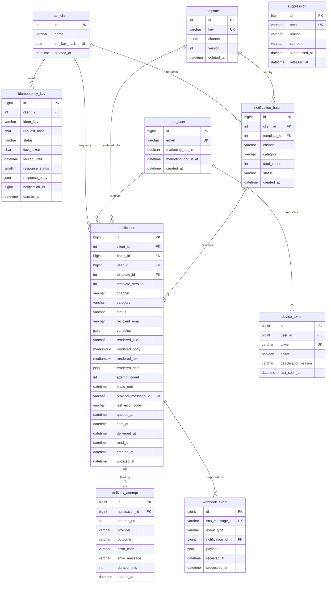

# ERD와 데이터 모델

Phase 2 이후 구현할 테이블의 구조, 인덱스, 관계를 정리한다. `template`은 Phase 0에서 이미 구현했고, 나머지는 해당 Phase에서 마이그레이션으로 추가한다. 알림 상태 값과 전이 규칙은 [상태 머신](state-machine.md)을 따른다.

## 공통 규칙

- PK는 `BIGINT UNSIGNED AUTO_INCREMENT`. 행이 적은 `template`, `api_client`만 `INT UNSIGNED`.
- 시각은 `DATETIME(3)` UTC. 기본값도 `CURRENT_TIMESTAMP(3)`.
- 인덱스와 제약에는 이름을 붙인다: `uq_<테이블>_<컬럼>`, `ix_<테이블>_<컬럼>`.
- 외래 키는 건다. 단, 대량 insert 경로(`notification`)의 외래 키는 참조 대상이 적고 조회가 PK라 비용이 작다.
- 상태와 분류 값은 MySQL `ENUM` 대신 `VARCHAR(20)`로 저장하고 애플리케이션에서 검증한다. 값이 늘 때 `ALTER TABLE`로 테이블 재작성을 하지 않기 위해서다. (`template.channel`은 Phase 0에서 ENUM으로 만들었고, 값이 고정이라 그대로 둔다.)

## 다이어그램

## 테이블

### api_client (Phase 2)

알림을 요청하는 내부 서비스. 멱등 키의 범위("어느 클라이언트의 키인가")와 인증 주체다.

| 컬럼         | 타입            | 설명                                     |
| ------------ | --------------- | ---------------------------------------- |
| id           | INT UNSIGNED PK |                                          |
| name         | VARCHAR(100)    | 서비스 이름                              |
| api_key_hash | CHAR(64)        | API 키의 SHA-256. 원문은 저장하지 않는다 |
| created_at   | DATETIME(3)     |                                          |

- `uq_api_client_api_key_hash (api_key_hash)`: 요청마다 키로 클라이언트를 찾는다.

### app_user (Phase 2)

수신자. 실제 서비스에서는 회원 서비스가 원본이고, 여기는 발송에 필요한 값만 가진 사본이다. `user`는 MySQL 예약어라 피했다.

| 컬럼                   | 타입               | 설명                                 |
| ---------------------- | ------------------ | ------------------------------------ |
| id                     | BIGINT UNSIGNED PK |                                      |
| email                  | VARCHAR(320)       | RFC 5321 최대 길이                   |
| marketing_opt_in       | BOOLEAN            | 마케팅 수신 동의                     |
| marketing_opt_in_at    | DATETIME(3) NULL   | 동의 시각 (정보통신망법상 동의 기록) |
| created_at, updated_at | DATETIME(3)        |                                      |

- `uq_app_user_email (email)`

### template (Phase 0, 구현됨)

`key` 유니크(삭제된 행 포함), `version`(낙관적 락), `deleted_at`(soft delete). 자세한 내용은 [README](../../README.md#템플릿-api)와 `src/templates/template.entity.ts`.

### notification (Phase 2)

수신자 1명·채널 1개당 1행. 이 프로젝트에서 행이 가장 많이 쌓이는 테이블이다.

내용은 **접수 시점에 렌더링해 저장**한다. Worker는 저장된 내용을 그대로 보내므로, 접수 뒤 템플릿이 수정·삭제돼도 발송 내용과 알림함 표시가 바뀌지 않는다.

| 컬럼                             | 타입                    | 설명                                                                                                                                              |
| -------------------------------- | ----------------------- | ------------------------------------------------------------------------------------------------------------------------------------------------- |
| id                               | BIGINT UNSIGNED PK      | BullMQ `jobId`로도 쓴다                                                                                                                           |
| client_id                        | INT UNSIGNED FK         | 요청한 클라이언트                                                                                                                                 |
| batch_id                         | BIGINT UNSIGNED NULL FK | 대량 발송이면 배치                                                                                                                                |
| user_id                          | BIGINT UNSIGNED NULL FK | 수신자. 푸시는 필수, 이메일은 회원이 아닌 주소로도 보낼 수 있어 NULL 허용                                                                         |
| template_id                      | INT UNSIGNED FK         |                                                                                                                                                   |
| template_version                 | INT                     | 렌더링에 쓴 템플릿 버전                                                                                                                           |
| channel                          | VARCHAR(20)             | `email` / `push`                                                                                                                                  |
| category                         | VARCHAR(20)             | `transactional` / `marketing`                                                                                                                     |
| status                           | VARCHAR(20)             | [상태 머신](state-machine.md) 참고                                                                                                                |
| recipient_email                  | VARCHAR(320) NULL       | 이메일 채널의 수신 주소 (접수 시점 값)                                                                                                            |
| variables                        | JSON                    | 렌더링 변수                                                                                                                                       |
| rendered_title                   | VARCHAR(255)            | 렌더링된 제목 (이메일 subject / 푸시 title)                                                                                                       |
| rendered_body                    | MEDIUMTEXT              | 렌더링된 본문 (이메일 HTML / 푸시 body)                                                                                                           |
| rendered_text                    | MEDIUMTEXT NULL         | 이메일 텍스트 대체 본문                                                                                                                           |
| rendered_data                    | JSON NULL               | 푸시 data                                                                                                                                         |
| attempt_count                    | INT                     | 발송 시도 횟수                                                                                                                                    |
| lease_until                      | DATETIME(3) NULL        | SENDING 점유 만료 시각. Worker가 발송 중 죽으면 이 시각이 지난 뒤에만 다른 Worker가 다시 가져간다 ([상태 머신](state-machine.md#발송-점유-lease)) |
| provider_message_id              | VARCHAR(255) NULL       | SES MessageId / FCM message name. 웹훅으로 알림을 찾는 키                                                                                         |
| last_error_code                  | VARCHAR(64) NULL        | 마지막 실패 코드                                                                                                                                  |
| queued_at, sent_at, delivered_at | DATETIME(3) NULL        | 상태별 시각                                                                                                                                       |
| read_at                          | DATETIME(3) NULL        | 읽음 시각. 상태와 별도                                                                                                                            |
| created_at, updated_at           | DATETIME(3)             |                                                                                                                                                   |

인덱스 (각각 어떤 조회를 위한 것인지):

| 이름                                  | 컬럼                                    | 쓰는 곳                                                          |
| ------------------------------------- | --------------------------------------- | ---------------------------------------------------------------- |
| `uq_notification_provider_message_id` | (provider_message_id)                   | 웹훅: SES MessageId로 알림 찾기. NULL은 유니크 검사에서 제외된다 |
| `ix_notification_status_updated_at`   | (status, updated_at)                    | Sweeper: "PENDING이고 N분 이상 지난 것", 관리자: DEAD 목록       |
| `ix_notification_user_created`        | (user_id, created_at, id)               | 알림함: 내 알림 최신순 커서 페이지                               |
| `ix_notification_user_read`           | (user_id, read_at)                      | 안읽음 개수: `WHERE user_id = ? AND read_at IS NULL`             |
| `ix_notification_batch`               | (batch_id)                              | 배치 진행 상황                                                   |
| `ix_notification_created_channel`     | (created_at, channel, category, status) | 기간별 통계, 발송 이력 검색 (Phase 6에서 EXPLAIN으로 조정)       |

### notification_batch (Phase 5)

대량 발송 1건. 배치 1 : 알림 N.

| 컬럼                   | 타입               | 설명                                  |
| ---------------------- | ------------------ | ------------------------------------- |
| id                     | BIGINT UNSIGNED PK |                                       |
| client_id              | INT UNSIGNED FK    |                                       |
| template_id            | INT UNSIGNED FK    |                                       |
| channel, category      | VARCHAR(20)        | 배치 전체에 공통                      |
| total_count            | INT                | 접수한 수신자 수                      |
| status                 | VARCHAR(20)        | `ACCEPTED` → `ENQUEUING` → `ENQUEUED` |
| created_at, updated_at | DATETIME(3)        |                                       |

### delivery_attempt (Phase 2)

발송 시도마다 1행. 장애 시나리오 3("5xx 3번 후 성공 → 4행")의 증거 테이블이다.

| 컬럼            | 타입               | 설명                                              |
| --------------- | ------------------ | ------------------------------------------------- |
| id              | BIGINT UNSIGNED PK |                                                   |
| notification_id | BIGINT UNSIGNED FK |                                                   |
| attempt_no      | INT                | 1부터                                             |
| provider        | VARCHAR(20)        | `ses` / `fcm` / `fake`                            |
| outcome         | VARCHAR(20)        | `SUCCESS` / `TRANSIENT_ERROR` / `PERMANENT_ERROR` |
| error_code      | VARCHAR(64) NULL   | 분류된 오류 코드                                  |
| error_message   | VARCHAR(500) NULL  | 원문 일부 (개인정보 제외)                         |
| duration_ms     | INT                | Provider 호출 시간                                |
| started_at      | DATETIME(3)        |                                                   |

- `uq_delivery_attempt_notification_attempt (notification_id, attempt_no)`: 같은 시도가 두 번 기록되지 않게 막고, 알림별 시도 이력을 순서대로 읽는다.

### suppression (Phase 3, 반송·신고 자동 등록은 Phase 4)

발송을 막는 이메일 주소. 반송·스팸 신고·관리자 등록으로 생긴다. 마케팅 수신 동의는 여기가 아니라 `app_user.marketing_opt_in`이다.

| 컬럼          | 타입               | 설명                                                      |
| ------------- | ------------------ | --------------------------------------------------------- |
| id            | BIGINT UNSIGNED PK |                                                           |
| email         | VARCHAR(320)       | 소문자로 정규화해 저장                                    |
| reason        | VARCHAR(20)        | `HARD_BOUNCE` / `COMPLAINT` / `INVALID_ADDRESS` / `ADMIN` |
| source        | VARCHAR(100) NULL  | 근거 (SNS MessageId, 관리자 ID 등)                        |
| suppressed_at | DATETIME(3)        |                                                           |
| released_at   | DATETIME(3) NULL   | 해제 시각. NULL이면 차단 중                               |

- 이미 차단 중인 주소를 다시 등록하면 처음 사유를 유지한다(재등록은 해제된 행만 갱신).
- `uq_suppression_email (email)`: 주소당 1행. 해제했다가 다시 차단되면 같은 행을 갱신한다(`released_at = NULL`, reason 갱신). 이력이 필요해지면 별도 로그 테이블을 둔다.

### device_token (Phase 2)

FCM 등록 토큰. 사용자 1명이 브라우저·기기 여러 개를 가질 수 있다.

| 컬럼                   | 타입               | 설명                                   |
| ---------------------- | ------------------ | -------------------------------------- |
| id                     | BIGINT UNSIGNED PK |                                        |
| user_id                | BIGINT UNSIGNED FK |                                        |
| token                  | VARCHAR(512)       | FCM 토큰 (길이 여유)                   |
| platform               | VARCHAR(20)        | `web`                                  |
| active                 | BOOLEAN            | 등록되지 않은 토큰 오류를 받으면 false |
| deactivation_reason    | VARCHAR(64) NULL   | 예: `UNREGISTERED`                     |
| last_seen_at           | DATETIME(3)        | 마지막 등록·갱신 시각                  |
| created_at, updated_at | DATETIME(3)        |                                        |

- `uq_device_token_token (token)`: 같은 토큰 재등록은 upsert(사용자 변경 포함).
- `ix_device_token_user_active (user_id, active)`: 발송 시 "이 사용자의 활성 토큰".

### idempotency_key (Phase 2)

요청 단위 멱등성. 처리 흐름은 [상태 머신](state-machine.md#멱등-키)과 ADR-002.

| 컬럼                   | 타입                 | 설명                                                                                   |
| ---------------------- | -------------------- | -------------------------------------------------------------------------------------- |
| id                     | BIGINT UNSIGNED PK   |                                                                                        |
| client_id              | INT UNSIGNED FK      | 키의 범위                                                                              |
| idem_key               | VARCHAR(255)         | `Idempotency-Key` 헤더 값                                                              |
| request_hash           | CHAR(64)             | 정규화한 요청 본문의 SHA-256                                                           |
| status                 | VARCHAR(20)          | `IN_PROGRESS` / `COMPLETED`                                                            |
| lock_token             | CHAR(36)             | 펜싱 토큰. 키를 잡을 때마다 새 UUID. `complete`·`abandon`은 이 값이 같을 때만 반영된다 |
| locked_until           | DATETIME(3)          | 처리 중 잠금 만료 시각. 지나면 다른 요청이 이어받을 수 있다                            |
| response_status        | SMALLINT NULL        | 저장한 응답 상태 코드                                                                  |
| response_body          | JSON NULL            | 저장한 응답 본문                                                                       |
| notification_id        | BIGINT UNSIGNED NULL | 만들어진 알림                                                                          |
| expires_at             | DATETIME(3)          | 키 보관 만료 (24시간)                                                                  |
| created_at, updated_at | DATETIME(3)          |                                                                                        |

- `uq_idempotency_key_client_key (client_id, idem_key)`: 동시에 같은 키가 와도 한 행만 생긴다 (장애 시나리오 1).
- `ix_idempotency_key_expires_at (expires_at)`: 만료 키 정리.

### webhook_event (Phase 4)

SNS가 보낸 SES 이벤트. 같은 메시지의 중복 수신을 막고 원본을 남긴다.

| 컬럼            | 타입                    | 설명                                         |
| --------------- | ----------------------- | -------------------------------------------- |
| id              | BIGINT UNSIGNED PK      |                                              |
| sns_message_id  | VARCHAR(100)            | SNS `MessageId`                              |
| event_type      | VARCHAR(30)             | `Delivery` / `Bounce` / `Complaint` / `Open` |
| notification_id | BIGINT UNSIGNED NULL FK | 매칭된 알림 (못 찾으면 NULL)                 |
| payload         | JSON                    | 원본                                         |
| received_at     | DATETIME(3)             |                                              |
| processed_at    | DATETIME(3) NULL        | 반영 완료 시각                               |

- `uq_webhook_event_sns_message_id (sns_message_id)`: 같은 메시지가 두 번 와도 한 번만 반영 (장애 시나리오 10).
- `ix_webhook_event_unprocessed (processed_at, received_at)`: 아직 반영하지 못한 이벤트 재처리. SES는 우리 쪽 `SENT` 기록(과 `provider_message_id` 저장)이 커밋되기 전에 Delivery를 보낼 수 있어서, 그때는 알림을 찾지 못한다. 이런 이벤트는 `processed_at = NULL`로 두고 주기 작업이 다시 매칭한다(24시간까지).

## 설계 질문에 대한 답

### 1. 대량 발송 1만 건을 1만 행으로 저장하면 insert 비용과 인덱스는?

- 500행씩 묶어 한 문장으로 insert한다(`INSERT ... VALUES (...), (...)`). 1만 행이면 20번의 왕복이다.
- 비용은 행 수보다 **보조 인덱스 수**에 비례한다. 행 하나마다 모든 보조 인덱스에도 쓰기가 일어나기 때문이다. 그래서 `notification`의 인덱스는 위 표의 조회가 실제로 필요한 것만 둔다.
- PK가 자동 증가라 새 행이 클러스터드 인덱스의 끝에 붙는다. 무작위 UUID를 PK로 쓰면 페이지 분할이 생겨 느려진다.
- 다중 행 insert의 자동 증가 값이 **연속이라고 가정하지 않는다.** MySQL 8의 기본 `innodb_autoinc_lock_mode = 2`(interleaved)에서는 다른 insert가 동시에 실행되면 한 문장이 받은 값이 연속이 아닐 수 있다고 공식 문서가 밝힌다. 그래서 BullMQ `jobId`에 쓸 id는 청크 insert 뒤 `batch_id`로 다시 조회해서 얻는다. ORM이 반환하는 id 목록이 이 가정에 기대는지도 Phase 5에서 확인한다.

### 2. 통계는 실시간 집계인가, 집계 테이블인가?

- **처음에는 실시간 집계**: `ix_notification_created_channel (created_at, channel, category, status)`로 기간 조건을 범위 스캔하고 그룹핑한다.
- Phase 6에서 100만 건 시드로 EXPLAIN과 응답 시간을 잰 뒤, 느리면 시간 단위 집계 테이블(`notification_stats_hourly`)을 주기 작업으로 채운다. 측정 전에 집계 테이블부터 만들면 동기화 문제만 늘어난다.

### 3. 이력이 계속 쌓이면?

- 보관 기간을 정한다: 알림 본문·`delivery_attempt`는 90일, 집계는 장기 보관.
- 오래된 행은 아카이브 테이블(또는 오브젝트 스토리지)로 옮기고 지운다. 한 번에 지우면 잠금과 복제 지연이 생기므로 PK 범위로 나눠 지운다.
- 규모가 더 커지면 `created_at` 기준 월별 RANGE 파티셔닝으로 파티션째 삭제한다. 단, MySQL 파티셔닝은 모든 유니크 키에 파티션 키가 들어가야 해서 PK를 `(id, created_at)`로 바꿔야 한다. 지금은 하지 않는다.

### 4. 읽음 상태는 notification 컬럼인가, 별도 테이블인가?

- **`notification.read_at` 컬럼**: 알림 1행이 수신자 1명이라 "누가 읽었나"를 따로 저장할 필요가 없다.
- 별도 테이블이 필요한 경우는 알림 1행을 여러 사용자가 받는 공지형(broadcast) 모델일 때다.
- 읽음은 상태 머신과 분리한다. 읽음 여부가 DELIVERED·BOUNCED 같은 발송 상태와 독립적으로 변하기 때문이다.

### 5. 웹훅 이벤트가 순서가 뒤바뀌어 오면? (Open이 Delivery보다 먼저)

- 상태 전이는 앞으로만 간다. 각 이벤트는 "허용된 이전 상태"를 조건으로 조건부 UPDATE를 한다. 이미 더 뒤 상태면 영향 행 0으로 무시된다.
- Open은 상태를 바꾸지 않고 `read_at`만 처음 한 번 채운다(`WHERE read_at IS NULL`). 그래서 Open이 먼저 와도, 뒤이어 온 Delivery가 SENT → DELIVERED 전이를 정상적으로 한다.
- 이벤트 원본은 `webhook_event`에 모두 남으므로, 나중에 순서를 재구성할 수 있다.
- 우리 쪽 `SENT` 기록보다 웹훅이 먼저 오는 경우도 있다. 그 이벤트는 알림을 아직 찾지 못하므로 미처리로 남겨 두고 재처리한다(위 `webhook_event` 인덱스 참고).

## 결정 요약

| 결정         | 선택                                               | 다른 선택지                                     |
| ------------ | -------------------------------------------------- | ----------------------------------------------- |
| PK           | BIGINT 자동 증가                                   | UUIDv7 (앱에서 생성, 열거 방지·생성 전 id 확보) |
| 멱등 키 처리 | 키를 먼저 별도 트랜잭션으로 잡는 2단계 + 잠금 만료 | 알림과 한 트랜잭션 (동시 요청은 잠금 대기)      |
| 읽음 상태    | `notification.read_at`                             | 별도 `notification_read` 테이블                 |
| 푸시 수신자  | 알림은 사용자 단위, 발송 시 활성 토큰 전체로 보냄  | 토큰 단위 알림 행                               |
| 수신거부     | 주소당 1행, 해제는 `released_at`                   | 이벤트 로그형 (행 추가만)                       |
| 통계         | 실시간 집계 → 측정 후 집계 테이블                  | 처음부터 집계 테이블                            |
| 상태 값 저장 | VARCHAR + 앱 검증                                  | MySQL ENUM                                      |
