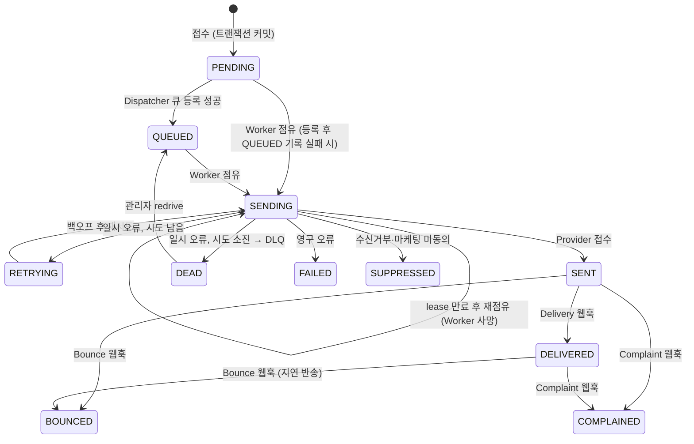
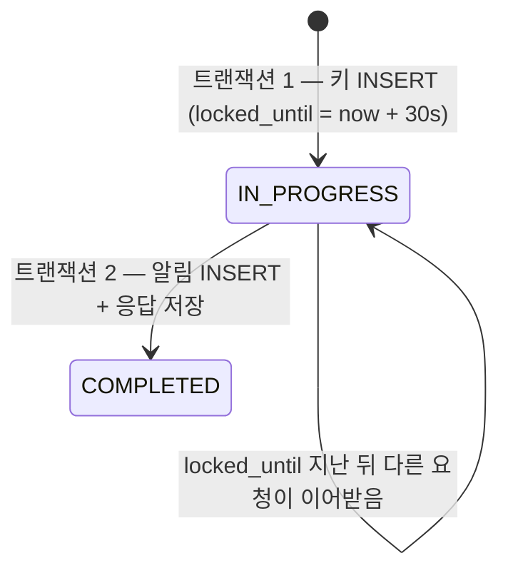

# 상태 머신

알림(`notification.status`)의 상태와 전이 규칙, 그리고 장애 시나리오 13개가 각각 어떤 전이로 처리되는지 정리한다. 테이블 구조는 [ERD](erd.md)를 따른다.

## 원칙

1. **모든 전이는 조건부 UPDATE 한 문장이다.**
   `UPDATE notification SET status = :to, ... WHERE id = :id AND status IN (:from...)`
   영향 행이 0이면 "다른 누군가가 이미 처리했다"는 뜻이므로 아무것도 하지 않는다. 먼저 조회하고 나중에 쓰지 않는다.
2. **상태는 앞으로만 간다.** 예외는 관리자 redrive(DEAD → QUEUED) 하나다. 늦게 도착한 웹훅처럼 되돌아가는 전이는 조건에 걸리지 않아 무시된다.
3. **외부 호출(SES, FCM) 동안 DB 트랜잭션을 잡지 않는다.** 전이는 호출 전후에 각각 짧게 커밋한다.
4. **읽음은 상태가 아니다.** `read_at` 컬럼으로 따로 관리한다.

## 상태

| 상태         | 의미                                           | 종결              |
| ------------ | ---------------------------------------------- | ----------------- |
| `PENDING`    | DB에 저장됨, 큐 등록 전                        |                   |
| `QUEUED`     | 큐에 등록됨                                    |                   |
| `SENDING`    | Worker가 점유하고 발송 중 (`lease_until`까지)  |                   |
| `RETRYING`   | 일시 오류, 백오프 후 재시도 대기               |                   |
| `SENT`       | Provider가 접수함 (도착 보장 아님)             |                   |
| `DELIVERED`  | 수신 서버 도착 확인 (SES Delivery 웹훅)        | 예*               |
| `FAILED`     | 영구 오류                                      | 예                |
| `DEAD`       | 재시도 한도 초과, DLQ에 보관                   | 예 (redrive 가능) |
| `SUPPRESSED` | 정책상 발송하지 않음 (수신거부, 마케팅 미동의) | 예                |
| `BOUNCED`    | 반송 (SES Bounce 웹훅)                         | 예                |
| `COMPLAINED` | 스팸 신고 (SES Complaint 웹훅)                 | 예                |

\* DELIVERED 이후에도 Complaint가 올 수 있다 (→ COMPLAINED).

## 상태도

## 전이 표

| #   | 전이                              | 누가                      | 조건 (`WHERE`)                              | 함께 바꾸는 값                                         |
| --- | --------------------------------- | ------------------------- | ------------------------------------------- | ------------------------------------------------------ |
| T1  | PENDING → QUEUED                  | Dispatcher (API, Sweeper) | `status = 'PENDING'`                        | `queued_at`                                            |
| T2  | PENDING·QUEUED·RETRYING → SENDING | Worker                    | `status IN ('PENDING','QUEUED','RETRYING')` | `lease_until = now + lease`, `attempt_count + 1`       |
| T2' | SENDING → SENDING (재점유)        | Worker                    | `status = 'SENDING' AND lease_until < now`  | 위와 같음                                              |
| T3  | SENDING → SENT                    | Worker                    | `status = 'SENDING'`                        | `provider_message_id`, `sent_at`, `lease_until = NULL` |
| T4  | SENDING → RETRYING                | Worker                    | `status = 'SENDING'`                        | `last_error_code`, `lease_until = NULL`                |
| T5  | SENDING → DEAD                    | Worker (마지막 시도)      | `status = 'SENDING'`                        | `last_error_code`, `lease_until = NULL`                |
| T6  | SENDING → FAILED                  | Worker                    | `status = 'SENDING'`                        | `last_error_code`, `lease_until = NULL`                |
| T7  | SENDING → SUPPRESSED              | Worker (발송 직전 검사)   | `status = 'SENDING'`                        | `lease_until = NULL`                                   |
| T8  | DEAD → QUEUED                     | 관리자 redrive            | `status = 'DEAD'`                           | `queued_at` (`attempt_count`는 유지\*)                 |
| T9  | SENT → DELIVERED                  | 웹훅                      | `status = 'SENT'`                           | `delivered_at`                                         |
| T10 | SENT·DELIVERED → BOUNCED          | 웹훅                      | `status IN ('SENT','DELIVERED')`            |                                                        |
| T11 | SENT·DELIVERED → COMPLAINED       | 웹훅                      | `status IN ('SENT','DELIVERED')`            |                                                        |

\* 초안은 redrive 때 `attempt_count = 0`이었다. 구현하며 고쳤다. 이 값은 `delivery_attempt`의 시도 번호(알림별 유니크)이자 결과 기록의 펜싱 번호라서 되돌리면 시도 번호가 겹치고 펜싱이 깨진다. 재시도 횟수는 redrive가 만드는 새 job이 새로 갖는다.

읽음은 상태와 무관하게:

| 동작                         | 조건                  | 결과                                                 |
| ---------------------------- | --------------------- | ---------------------------------------------------- |
| 읽음 (알림함 API, Open 웹훅) | `read_at IS NULL`     | `read_at = now`. 이미 읽었으면 영향 행 0 → 시각 불변 |
| 안읽음 (알림함 API)          | `read_at IS NOT NULL` | `read_at = NULL`                                     |

## 세부 규칙

### 큐 등록 (T1)

- 접수 트랜잭션이 커밋된 **뒤**, 트랜잭션 밖에서 `queue.add(jobId = notification-{id})`(BullMQ는 숫자만으로 된 custom id를 받지 않는다) 후 T1을 실행한다.
- 큐 등록이 실패하면(Redis 장애) 알림은 PENDING으로 남는다. Sweeper가 일정 시간(예: 1분) 이상 PENDING인 알림을 다시 등록한다.
- 큐 등록은 성공했는데 T1이 실패하면(DB 순간 장애) 알림은 PENDING인 채 job이 실행된다. 그래서 Worker의 점유 조건(T2)에 PENDING을 포함한다. 이 경우 Sweeper가 같은 `jobId`로 다시 등록해도 BullMQ가 중복 job을 만들지 않는다.

### 발송 점유 (lease)

- Worker는 T2로 점유할 때 `lease_until`을 "지금 + Provider 호출 제한 시간 + 여유"(예: 60초)로 정한다. 시각은 DB 시계(`UTC_TIMESTAMP(3)`)로 계산해 Worker 인스턴스 간 시계 차이의 영향을 받지 않게 한다.
- 결과 기록의 조건은 성공과 실패가 다르다.
  - T3(SENT)는 `status = SENDING`만 본다. lease를 잃은 Worker라도 발송이 실제로 성공했다면 "보냈다"는 기록이 사실이기 때문이다.
  - T4·T6(RETRYING·FAILED)은 `attempt_count = 내 시도 번호`까지 본다(펜싱). lease를 잃은 옛 Worker의 실패가, 재점유한 새 Worker의 발송을 실패로 덮어쓰지 않게 한다.
- Worker가 발송 중 죽으면(`kill -9`) BullMQ가 stalled job으로 감지해 다시 실행한다. 그때 알림은 SENDING이므로 T2'로만 다시 점유할 수 있고, lease가 남아 있으면 영향 행 0이다.
  - 이때 Worker는 job을 성공으로 끝내지 않는다. 아래처럼 lease가 끝날 때까지 미룬 뒤 다시 시도하고, lease가 지나면 T2'가 성공한다.
- lease가 살아 있으면 job을 실패시키지 않고 lease가 끝나는 시각(+1초)으로 미룬다(`job.moveToDelayed` + `DelayedError`). 실패로 처리하면 확인할 때마다 재시도 횟수를 써 버려, 죽은 Worker의 건이 DEAD가 될 수 있기 때문이다.
- BullMQ stall 설정과의 관계: `lockDuration` 30초(실행 중에는 15초마다 갱신), `stalledInterval` 30초, `maxStalledCount` 1. Worker가 죽으면 최대 약 60초 안에 job이 대기열로 돌아오고, lease(60초)가 남았으면 위처럼 미뤄진다. 같은 job이 두 번 stall되면 실패로 끝나고, 그 알림은 Sweeper가 10분 뒤 다시 넣는다.
- 죽은 Worker가 실제로 Provider 호출까지 끝냈다면, 재점유 후 같은 알림이 한 번 더 발송된다. SES·FCM에는 멱등 키가 없어 이 중복은 막을 수 없다(at-least-once, ADR-002). 장애 시나리오 6에서 이 중복 횟수를 측정해 기록한다.

### 재시도와 DLQ (T4, T5)

- BullMQ job 옵션 `attempts`(기본 5, `SEND_MAX_ATTEMPTS`)와 BullMQ 내장 지수 백오프(`exponential`, 기본 2초 × 2^(n-1), `jitter: 0.5`)를 쓴다. 지연을 직접 계산하지 않고 내장 옵션을 쓴 이유: 지수 + jitter가 이미 지원되고, 직접 구현할수록 테스트할 것만 늘어난다.
- 무엇을 할지는 `src/queue/failure-policy.ts`의 순수 함수가 정한다: 영구 → FAILED, 일시 + 시도 남음 → RETRYING, 일시 + 마지막 시도 → DEAD.
- Provider 호출이 성공한 뒤 결과 기록(T3)이 실패하면 Provider 실패로 기록하지 않는다. job은 그 오류로 실패하고, 재시도는 lease 만료 뒤 재점유로 이어진다(이 경우 중복 발송 가능 — at-least-once).
- 일시 오류이고 남은 시도가 있으면 T4 후 오류를 던져 BullMQ가 재시도하게 한다.
- 마지막 시도에서도 일시 오류면 T5 후 DLQ 큐(`notification-dlq`)에 알림 id를 넣는다.
- 영구 오류는 T6 후 `UnrecoverableError`를 던져 BullMQ가 재시도하지 않게 한다.

### 발송 직전 검사 (T7)

- 수신거부·마케팅 동의는 **접수 시점이 아니라 발송 직전**에 확인한다. 접수와 발송 사이에 사용자가 수신을 거부할 수 있기 때문이다.
- 그래서 SUPPRESSED는 SENDING에서 간다. (초안의 "PENDING·QUEUED → SUPPRESSED"를 이렇게 고쳤다.)

### 웹훅 (T9~T11)

- 웹훅은 `provider_message_id`로 알림을 찾는다.
- SES가 우리 쪽 T3 커밋보다 먼저 이벤트를 보내면 알림을 찾지 못한다. 이벤트를 `webhook_event`에 미처리로 남기고 재처리한다.
- Open은 상태를 바꾸지 않고 읽음만 기록한다. 그래서 Open이 Delivery보다 먼저 와도 문제가 없다.
- 이미 DELIVERED인데 늦게 Delivery가 다시 오면 T9 조건(`status = 'SENT'`)에 걸리지 않아 무시된다.

### 멱등 키

`idempotency_key.status`는 알림 상태와 별개다.

같은 (클라이언트, 키)로 요청이 오면:

| 기존 키 상태           | 본문 해시 | 응답                                   |
| ---------------------- | --------- | -------------------------------------- |
| 없음                   | —         | 새로 처리 (202)                        |
| COMPLETED              | 같음      | 저장된 응답 그대로 (202, 같은 알림 id) |
| COMPLETED·IN_PROGRESS  | 다름      | 422 `idempotency-key-reused`           |
| IN_PROGRESS, 잠금 유효 | 같음      | 409 `idempotency-key-in-progress`      |
| IN_PROGRESS, 잠금 만료 | 같음      | 조건부 UPDATE로 이어받아 처리          |

잠금이 만료돼 다른 요청이 이어받은 뒤, 처음 요청이 사실은 살아 있다가 완료를 시도할 수 있다. 그래서 키를 잡을 때마다 새 `lock_token`(펜싱 토큰)을 발급하고, 완료(`COMPLETED` 기록)는 `WHERE id = ? AND status = 'IN_PROGRESS' AND lock_token = ?`로만 한다. 토큰이 다르면 영향 행이 0이고, 이 오류가 같은 트랜잭션의 알림 INSERT까지 롤백한다. 키 삭제(`abandon`)도 같은 조건이다.

## 장애 시나리오 매핑

| #   | 시나리오                      | 처리하는 전이·규칙                                                    | 쓰는 데이터                                                         | 검증                                              |
| --- | ----------------------------- | --------------------------------------------------------------------- | ------------------------------------------------------------------- | ------------------------------------------------- |
| 1   | 같은 Idempotency-Key 동시 2번 | 멱등 키 트랜잭션 1의 유니크 제약. 한쪽은 409(처리 중) 또는 저장된 202 | `uq_idempotency_key_client_key`                                     | Jest + Testcontainers: 동시 요청 후 알림 1행      |
| 2   | DB 커밋 직후 Redis 다운       | T1 실패 → PENDING 유지 → Redis 복구 후 Sweeper가 재등록 → T1          | `ix_notification_status_updated_at`                                 | chaos 스크립트: PENDING 수 → 0, 전송 수 = 접수 수 |
| 3   | Provider 5xx 3번              | T2 → T4 ×3 → T2 → T3                                                  | `delivery_attempt` 4행 (`uq_delivery_attempt_notification_attempt`) | E2E (FakeProvider 실패 주입)                      |
| 4   | 잘못된 이메일 주소            | T2 → T6(영구 오류, 재시도 없음) + `suppression` 등록                  | `suppression.reason = INVALID_ADDRESS`                              | E2E: 시도 1행, FAILED, 수신거부 1행               |
| 5   | 최대 재시도 초과              | T4 반복 → T5 + DLQ 등록 → redrive T8 → T2 → T3                        | DLQ job, `status = DEAD`                                            | E2E: DEAD 확인 → redrive → SENT                   |
| 6   | Worker `kill -9`              | lease 만료 후 T2'로 재점유 → T3                                       | `lease_until`, `attempt_count`                                      | chaos 스크립트: 최종 SENT, 중복 발송 횟수 기록    |
| 7   | Worker SIGTERM                | 정상 종료 시 진행 중 job 완료 대기(T3 또는 T4까지) 후 종료            | —                                                                   | chaos 스크립트: stalled 0건                       |
| 8   | 수신거부 사용자               | T2 → T7 (Provider 호출 없음)                                          | `suppression`, `app_user.marketing_opt_in`                          | E2E: SUPPRESSED, 시도 0행                         |
| 9   | 등록되지 않은 FCM 토큰        | 해당 토큰 비활성화. 남은 활성 토큰이 없고 모두 영구 오류면 T6         | `device_token.active = false`                                       | E2E (Fake): 재시도 없음, 토큰 비활성              |
| 10  | 같은 SNS 메시지 2번           | `webhook_event` INSERT 유니크 위반 → 두 번째는 무시                   | `uq_webhook_event_sns_message_id`                                   | E2E: 이벤트 1행, 상태 변화 1번                    |
| 11  | 위조된 SNS 서명               | 서명 검증 실패 → 403, 아무것도 저장하지 않음                          | —                                                                   | E2E: 403, `webhook_event` 0행                     |
| 12  | 같은 읽음 요청 반복           | `read_at IS NULL` 조건 → 두 번째는 영향 행 0                          | `read_at`                                                           | E2E: 응답 같고 `read_at` 불변                     |
| 13  | 마케팅 1만 건 중 인증 메일    | 큐 분리: `email-transactional`은 마케팅 큐와 별도 Worker              | 큐 4개 (ADR-001)                                                    | 실험: 분리 전후 인증 메일 대기 시간               |

## 반례 검토로 고친 것

처음 계획한 상태 머신 초안을 시나리오에 대입하며 찾은 문제와 수정이다.

| 문제                               | 초안에서 일어나는 일                                                                             | 수정                                 |
| ---------------------------------- | ------------------------------------------------------------------------------------------------ | ------------------------------------ |
| Worker가 발송 중 죽음 (시나리오 6) | 알림이 SENDING에 남고, 재실행된 job은 `QUEUED → SENDING` 조건에 걸리지 않아 영원히 발송되지 않음 | `lease_until`과 재점유 전이 T2' 추가 |
| 큐 등록 성공 후 QUEUED 기록 실패   | 알림은 PENDING인데 job이 실행됨 → 조건 불일치로 발송 안 됨                                       | Worker 점유 조건에 PENDING 포함      |
| 수신거부를 언제 검사하나           | 초안은 PENDING·QUEUED에서 SUPPRESSED. 접수 후 수신을 거부하면 놓침                               | 발송 직전(SENDING)에 검사            |
| 마지막 재시도 실패                 | 초안은 RETRYING → DEAD. 실제로는 실패 시점의 상태가 SENDING                                      | SENDING → DEAD                       |
| SENT 기록 전에 웹훅 도착           | 알림을 찾지 못해 Delivery를 잃음                                                                 | 미처리 이벤트로 남겨 재처리          |
| DELIVERED 후 지연 반송             | 초안에 없음                                                                                      | DELIVERED → BOUNCED 허용             |
