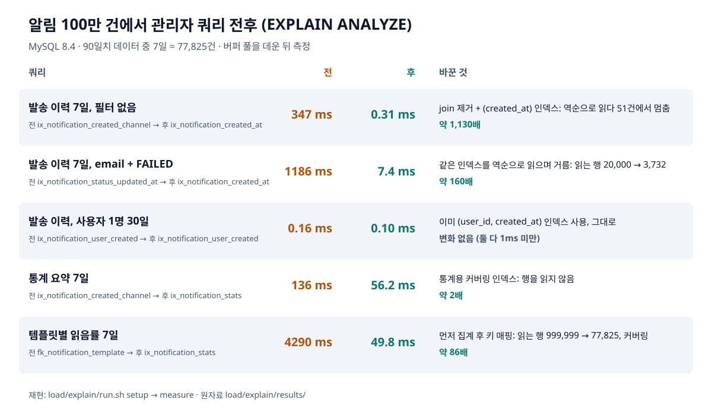

# 알림 100만 건 쿼리 측정 (이슈 #83)

관리자 API(발송 이력 검색, 통계 요약, 읽음률)가 알림 100만 건에서 인덱스를 타는지 `EXPLAIN ANALYZE`로 확인하고 고쳤다.

## 조건

- 전용 MySQL 8.4(`np-explain` 스택, `chaos/compose.yml`의 mysql·migrate만). 개발 DB와 공유하지 않는다.
- [seed.sql](seed.sql): 2026-10-10 이전 90일에 고르게 퍼진 알림 1,000,000건. 이메일 2/3, 마케팅 1/5, 실패·반송·차단 몇 %, 푸시는 사용자 1만 명. 값이 결정적이라 다시 만들어도 같다.
- 질의는 앱이 실제로 보내는 SQL을 로그로 받아 기간만 고정한 것([queries/](queries)). 3번 실행해 버퍼 풀을 데운 뒤 `EXPLAIN ANALYZE`의 전체 시간을 쓴다.

## 결과

[results/summary.md](results/summary.md), 계획 원문은 `results/1-before/`(전)와 `results/8-final/`(후).



## 찾은 것과 고친 것

1. **TypeORM `take()` + join = DISTINCT 임시 테이블.** 이력 검색이 `innerJoinAndSelect` 뒤에 `take()`를 써서, TypeORM이 "기간 안 모든 행의 모든 열(본문 포함)을 담은 파생 테이블에서 DISTINCT id"를 먼저 구한 뒤 LIMIT했다. 7일이면 77,825행을 임시 테이블에 담는다. DLQ 목록도 같은 형태였다(`relationLoadStrategy: 'query'`로 바꿈).
2. **`limit()`로 바꿔도 join이 남으면 정렬을 피하지 못한다.** MySQL이 template과 hash join한 뒤 77,825행을 정렬했다(306ms). 이력 목록에 필요한 것은 템플릿 키뿐이라 join을 빼고 키는 페이지에 나온 템플릿 id 몇 개로 따로 조회한다.
3. **정렬 순서와 같은 인덱스가 없었다.** 기존 `(created_at, channel, category, status)`는 `ORDER BY created_at DESC, id DESC`를 만족하지 못한다. InnoDB 보조 인덱스 끝에는 PK가 붙으므로 `(created_at)` 단일 인덱스가 곧 `(created_at, id)`다. 역순으로 읽다 51건에서 멈춘다(0.31ms). join 제거만 하면 107ms, 인덱스만 더하면 395ms로, 둘 다 있어야 했다.
4. **읽음률은 옵티마이저가 template부터 돌았다.** template 3행 각각에 대해 FK 인덱스로 알림 33만 건씩, 999,999행을 읽었다(4.3초). 알림만으로 `template_id`별로 먼저 집계하고 키는 나중에 붙인다.
5. **통계 두 쿼리를 덮는 인덱스.** `read_at`(읽음 집계)과 `template_id`가 인덱스에 없어 행을 읽어야 했다. 기존 인덱스를 `(created_at, channel, category, status, template_id, read_at)`로 넓혀 두 쿼리 모두 인덱스만 읽는다.
6. 덤으로 찾은 버그: `deleted_at IS NULL` 조건이 붙은 inner join 때문에 삭제된 템플릿으로 보낸 알림이 이력과 읽음률에서 빠지고 있었다. join을 없애며 같이 고쳤다(E2E 추가).

## 비용

- 인덱스 크기(100만 건): `ix_notification_stats` 60.7MB, `ix_notification_created_at` 23.5MB. 테이블(PK) 164.7MB.
- `read_at`이 인덱스에 들어가 읽음 처리(UPDATE) 때 이 인덱스도 고친다. 읽음은 알림당 한 번이라 받아들였다.
- 이메일 주소 검색(`email`)은 기간 안에서만 거른다. 자주 쓰이면 `(recipient_email, created_at)`를 더한다.

## 다시 재기

```bash
bash load/explain/run.sh setup                                   # 새 MySQL + 마이그레이션 + 100만 건 (약 1분)
bash load/explain/run.sh measure 8-final load/explain/queries/*.nojoin.sql load/explain/queries/s1-summary-7d.sql
node load/explain/report.mjs                                     # 표와 그림 다시 만들기
bash load/explain/run.sh down
```

전(1-before)을 다시 재려면 이 PR 전의 마이그레이션 상태에서 `*.before.sql`과 `s*.sql`을 잰다.
