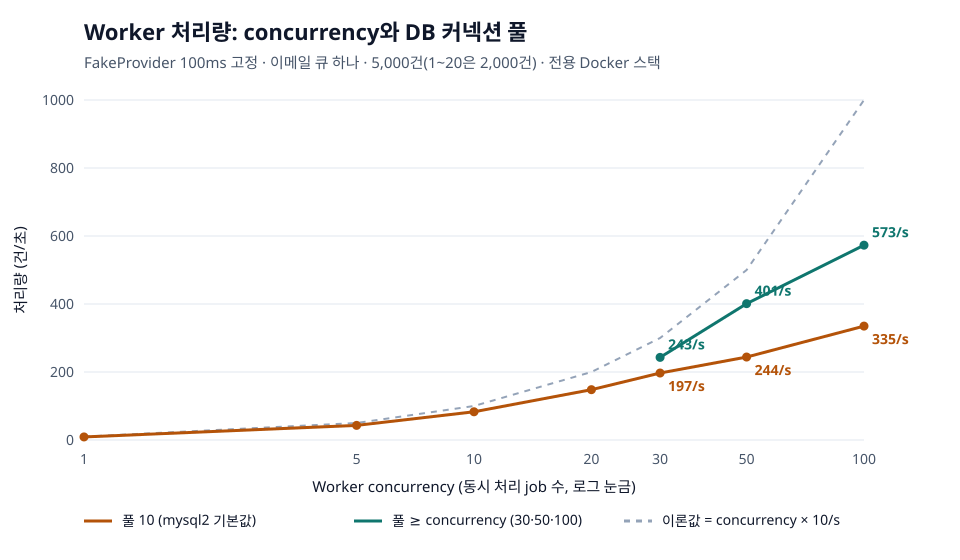

# 접수 부하와 Worker 처리량 (이슈 #91)

## 조건

- 전용 Docker 스택(`np-perf`, `chaos/compose.yml` + [compose.yml](compose.yml)): API 1개, Worker 1개, MySQL 8.4, Redis 7.4. 한 대의 개발 PC(Docker Desktop)에서 잰 값이라 절대값보다 비교가 의미 있다.
- FakeProvider 지연 100ms 고정, 발송 한도는 걸리지 않게 크게. 그래서 concurrency `c`의 이론 처리량은 `c × 10건/초`다.
- Worker: Worker를 멈춘 채 대량 발송으로 job을 쌓은 뒤 Worker를 켜고, 모두 `SENT`가 될 때까지 걸린 시간을 DB(`delivery_attempt.started_at`, `notification.sent_at`)로 잰다. `WORKER_CONCURRENCY`로 모든 송신 큐의 concurrency를, `DB_POOL_SIZE`로 커넥션 풀을 바꾼다.
- 접수: k6(`grafana/k6:2.2.0`)로 `POST /notifications`를 30초 동안. 요청마다 새 Idempotency-Key라 매번 알림 저장과 큐 등록이 일어난다.

## 결과

[results/summary.md](results/summary.md)



## 병목: DB 커넥션 풀

- concurrency를 올려도 처리량이 이론값만큼 늘지 않았다. 효율이 c=10에서 0.84, 30에서 0.72, 50에서 0.58, 100에서 0.45로 떨어지고, job 하나의 처리 시간 p95도 102ms에서 173ms로 늘었다.
- Provider 호출은 DB 커넥션을 잡지 않지만, job마다 점유(UPDATE)와 결과 기록(트랜잭션)에서 커넥션을 쓴다. 풀은 mysql2 기본값 10개라 동시에 도는 job이 10개를 넘으면 커넥션을 기다린다.
- 풀만 바꿔 확인했다. c=50에서 풀 10 → 50: 244 → 401건/초(+64%), p95 137 → 108ms. c=100에서 풀 50과 100은 같았다(562, 573건/초). 그 위의 한계는 풀이 아니라 다른 곳(Node 이벤트 루프, Redis 왕복)이다.
- **개선:** 기본 `DB_POOL_SIZE`를 10에서 30으로 올렸다. 기본 Worker는 송신 큐 4개의 concurrency 합이 30(10+5+10+5)이라, 모든 큐가 바쁠 때 30개가 동시에 돈다. c=30에서 풀 10 → 30: **197 → 243건/초(+23%), job p95 120 → 102ms**.
- 규칙: 프로세스당 풀 ≥ 그 프로세스가 동시에 처리하는 job 수. 인스턴스를 늘릴 때는 `인스턴스 수 × 풀 < MySQL max_connections`(기본 151)를 확인한다.

## 접수

- 가상 사용자 10명: 357건/초, p95 35ms. 50명: 431건/초, p95 145ms, p99 324ms. 모두 202.
- 프로세스 하나가 초당 400여 건에서 포화된다. 요청마다 멱등 키 INSERT, 알림 저장 트랜잭션, 큐 등록, 상태 UPDATE가 있어 DB 왕복이 4~5번이다. 더 필요하면 API 인스턴스를 늘린다(상태는 DB와 Redis에만 있다).

## 다시 재기

```bash
bash load/perf/run.sh worker 30 10     # concurrency 30, 풀 10
JOBS=5000 bash load/perf/run.sh worker 50 50
bash load/perf/run.sh intake 50        # k6 가상 사용자 50명
bash load/perf/run.sh down
node load/perf/graph.mjs               # results/rows.jsonl → 표와 그래프
```

원자료(job별 시각 TSV)는 다시 만들 수 있어 커밋하지 않는다.
